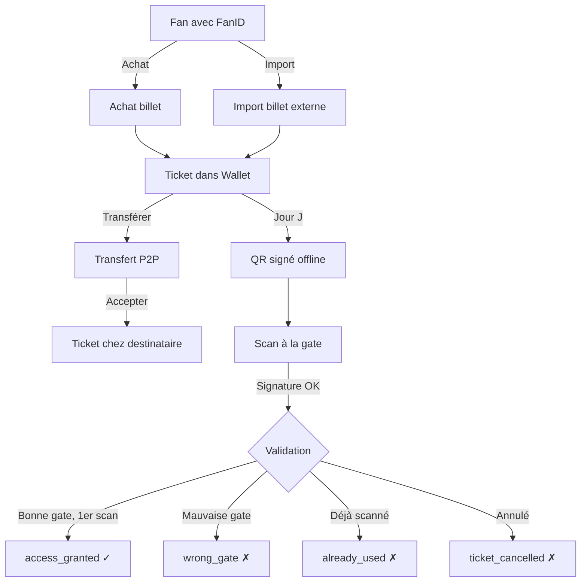

# Smart Ticketing — Plan d'implémentation

## 1. État des lieux

### Ce qui existe déjà ✅

| Composant                   | État                                                                                                                                             |
| --------------------------- | ------------------------------------------------------------------------------------------------------------------------------------------------ |
| `fan` table (DB)            | Présent — first_name, last_name, email, phone, nationality, language, supported_team, fan_profile, fan_id_status, document_type, document_number |
| Auth (register/login/JWT)   | Présent — `backend/auth.py`                                                                                                                      |
| Profil + FanID vérification | Présent — `backend/auth.py` endpoints, `ProfileView.tsx`                                                                                         |
| `ticket` table              | Présent — fan_id, match_id/event_id, gate_id, qr_payload, qr_signature, status, access_rules                                                     |
| `ticket_tier` table         | Présent — event_type, event_id, name, price_mad, benefits                                                                                        |
| `ticket_purchase` table     | Présent — fan_id, ticket_id, tier_name, quantity, total_mad                                                                                      |
| Frontend TicketView         | Présent — wallet, achat mock, QR visuel                                                                                                          |

### Ce qui manque ❌

| Fonctionnalité                                                    | Priorité |
| ----------------------------------------------------------------- | -------- |
| FanID enrichi (photo, accessibility_needs, expires_at, suspended) | Haute    |
| Import billet externe (QR scan, PDF, référence)                   | Haute    |
| Transfert P2P de billets                                          | Haute    |
| QR sécurisé (signature HMAC, offline-first)                       | Haute    |
| Scan validation (endpoint + logique multi-résultat)               | Haute    |
| Mode offline (cache, Wallet, PDF)                                 | Moyenne  |
| Dashboard organisateur                                            | Moyenne  |

---

## 2. Mise à jour du schéma DB

### 2.1 Fan — champs à ajouter

```sql
ALTER TABLE fan ADD COLUMN photo_url TEXT;
ALTER TABLE fan ADD COLUMN accessibility_needs VARCHAR(30) DEFAULT NULL
    CHECK (accessibility_needs IS NULL OR accessibility_needs IN ('pmr', 'family', 'assistance', 'none'));
ALTER TABLE fan ADD COLUMN fan_id_expires_at TIMESTAMP DEFAULT NULL;

-- Mise à jour du CHECK constraint existant
-- fan_id_status: pending, verified, rejected, suspended, expired
```

### 2.2 Nouvelles tables

**Transfert de billets**

```sql
CREATE TABLE ticket_transfer (
    id              UUID PRIMARY KEY DEFAULT gen_uuid(),
    ticket_id       UUID NOT NULL REFERENCES ticket(id) ON DELETE CASCADE,
    from_fan_id     UUID NOT NULL REFERENCES fan(id),
    to_email        VARCHAR(255) NOT NULL,
    to_fan_id       UUID REFERENCES fan(id),
    status          VARCHAR(20) NOT NULL DEFAULT 'pending'
                        CHECK (status IN ('pending', 'accepted', 'rejected', 'cancelled', 'expired')),
    transfer_code   VARCHAR(8) NOT NULL UNIQUE,
    created_at      TIMESTAMP NOT NULL DEFAULT NOW(),
    accepted_at     TIMESTAMP,
    expires_at      TIMESTAMP NOT NULL
);

CREATE INDEX idx_transfer_ticket ON ticket_transfer(ticket_id);
CREATE INDEX idx_transfer_to_email ON ticket_transfer(to_email);
```

**Scans d'entrée**

```sql
CREATE TABLE ticket_scan (
    id              UUID PRIMARY KEY DEFAULT gen_uuid(),
    ticket_id       UUID NOT NULL REFERENCES ticket(id),
    gate_id         UUID NOT NULL REFERENCES gate(id),
    scanned_at      TIMESTAMP NOT NULL DEFAULT NOW(),
    result          VARCHAR(30) NOT NULL
                        CHECK (result IN (
                            'access_granted', 'wrong_gate', 'already_used',
                            'invalid_ticket', 'fan_id_required', 'ticket_cancelled',
                            'manual_review'
                        )),
    device_id       VARCHAR(100),
    synced          BOOLEAN NOT NULL DEFAULT FALSE,
    operator_notes  TEXT
);

CREATE INDEX idx_scan_ticket ON ticket_scan(ticket_id);
CREATE INDEX idx_scan_gate ON ticket_scan(gate_id);
CREATE INDEX idx_scan_result ON ticket_scan(result);
CREATE INDEX idx_scan_synced ON ticket_scan(synced);
```

---

## 3. QR Code sécurisé — Design

### Approche choisie : QR statique signé + contrôle anti-réutilisation

```
QR Payload (JSON signé) :
{
  "ticket_id": "TCK-...",
  "fan_id": "FP-...",
  "event_id": "EVT-...",
  "gate_code": "C",
  "seat": "Rang 12 - Siège 47",
  "issued_at": "2030-06-14T12:00:00Z",
  "expires_at": "2030-06-14T23:00:00Z",
  "nonce": "random-bytes"
}

QR Signature = HMAC-SHA256(payload, SECRET_KEY)
QR final = Base64(payload || "." || signature)
```

**Propriétés :**

- Le QR est signé côté serveur → impossible à forger
- Le `nonce` empêche le replay (chaque billet a un nonce unique)
- Le scan vérifie : signature valide + billet non déjà scanné + bon match + bonne gate
- Fonctionne **offline** si la clé publique est préchargée sur le scanner

---

## 4. Backend — Nouveaux endpoints

### 4.1 Ticketing

| Méthode | Route                                 | Rôle                                    |
| ------- | ------------------------------------- | --------------------------------------- |
| GET     | `/api/tickets`                        | Liste des billets du fan connecté       |
| GET     | `/api/tickets/{id}`                   | Détail + QR payload d'un billet         |
| POST    | `/api/tickets/purchase`               | Achat d'un billet (match/zone/event)    |
| POST    | `/api/tickets/import`                 | Import billet externe (référence ou QR) |
| POST    | `/api/tickets/{id}/transfer`          | Initier un transfert                    |
| POST    | `/api/tickets/transfer/accept/{code}` | Accepter un transfert                   |
| GET     | `/api/tickets/{id}/qr`                | Générer le QR signé                     |

### 4.2 Scan validation

| Méthode | Route                        | Rôle                        |
| ------- | ---------------------------- | --------------------------- |
| POST    | `/api/scan/validate`         | Scanner un QR → résultat    |
| GET     | `/api/scan/stats/{match_id}` | Stats de scan pour un match |

### 4.3 Événements (catalogue)

| Méthode | Route                    | Rôle                                  |
| ------- | ------------------------ | ------------------------------------- |
| GET     | `/api/events`            | Catalogue matchs + fan zones + events |
| GET     | `/api/events/{id}`       | Détail + tiers disponibles            |
| GET     | `/api/events/{id}/tiers` | Tiers tarifaires                      |

---

## 5. Frontend — Modifications

### 5.1 TicketView — enrichir

- Supprimer les données mockées (`MATCH_EVENTS`, `FAN_ZONE_EVENTS`, etc.)
- Remplacer par des appels API (`GET /api/events`, `GET /api/tickets`)
- Ajouter bouton « Importer un billet »
- Ajouter bouton « Transférer » sur chaque billet

### 5.2 Nouveau composant : ImportTicketView

```
Écran d'import :
  - Scanner un QR (caméra)
  - Saisir une référence de billet
  - Importer un PDF (simulé)
  → POST /api/tickets/import
  → Billet ajouté au wallet
```

### 5.3 Nouveau composant : TransferModal

```
Modal de transfert :
  - Sélectionner un billet
  - Saisir l'email du destinataire
  → POST /api/tickets/{id}/transfer
  → Code de transfert généré
  → Notification au destinataire
```

### 5.4 Nouveau composant : AcceptTransferView

```
Écran d'acceptation :
  - Saisir le code de transfert (reçu par email)
  → POST /api/tickets/transfer/accept/{code}
  → Billet lié au FanID du destinataire
```

### 5.5 ScanView (simulation)

```
Écran de scan (mode organisateur) :
  - Caméra pour scanner un QR
  → POST /api/scan/validate
  → Résultat affiché : ✅ Accès autorisé / ❌ Déjà utilisé / ⚠️ Mauvaise gate
```

---

## 6. Flux principaux

### 6.1 Achat → Entrée

```
Fan → Login → Consulte catalogue → Choisit match + tier → Achat → QR dans wallet
     → Jour du match : ouvre QR → Scan à la gate → Validation → Entrée
```

### 6.2 Import externe

```
Fan → Login → "Importer un billet" → Scanne QR officiel / saisit référence
     → Le système vérifie que le billet n'est pas déjà lié
     → Billet lié au FanID → QR FanPass généré → Wallet
```

### 6.3 Transfert P2P

```
Tracy → Sélectionne billet → "Transférer" → Saisit email de Danielle
      → Code de transfert généré (valide 24h)
Danielle → Reçoit email/notification → Ouvre l'app → "Accepter transfert"
         → Saisit le code → Billet lié à son FanID → Dans son wallet
```

### 6.4 Scan validation

```
Scanner → Capture QR → Décode payload → Vérifie signature HMAC
        → Vérifie billet.status ≠ 'scanned'
        → Vérifie match.date = aujourd'hui
        → Vérifie gate.code correspond
        → Résultat : access_granted | wrong_gate | already_used | ...
```

---

## 7. Ordre d'implémentation

| #   | Tâche                                                      | Dépendance |
| --- | ---------------------------------------------------------- | ---------- |
| 1   | Mettre à jour le schéma DB (fan enrichi + transfer + scan) | -          |
| 2   | Mettre à jour `backend/models.py`                          | 1          |
| 3   | Créer `backend/tickets.py` (purchase, import, list, qr)    | 2          |
| 4   | Créer `backend/scan.py` (validate)                         | 2          |
| 5   | QR signing logic (HMAC) dans `backend/tickets.py`          | 2          |
| 6   | Mettre à jour `backend/main.py` (nouveaux routers)         | 3, 4       |
| 7   | Mettre à jour `TicketView.tsx` (API calls, remove mocks)   | 3          |
| 8   | Créer `ImportTicketView.tsx`                               | 3          |
| 9   | Créer `TransferModal.tsx`                                  | 3          |
| 10  | Créer `AcceptTransferView.tsx`                             | 3          |
| 11  | Créer `ScanView.tsx` (simulation scanner)                  | 4          |
| 12  | Dashboard mini (stats scan)                                | 4          |

---

## 8. Diagramme de flux



Ce plan couvre l'intégralité de la spec fournie, focalisé sur le fan (partie organisateur dashboard minimale).
